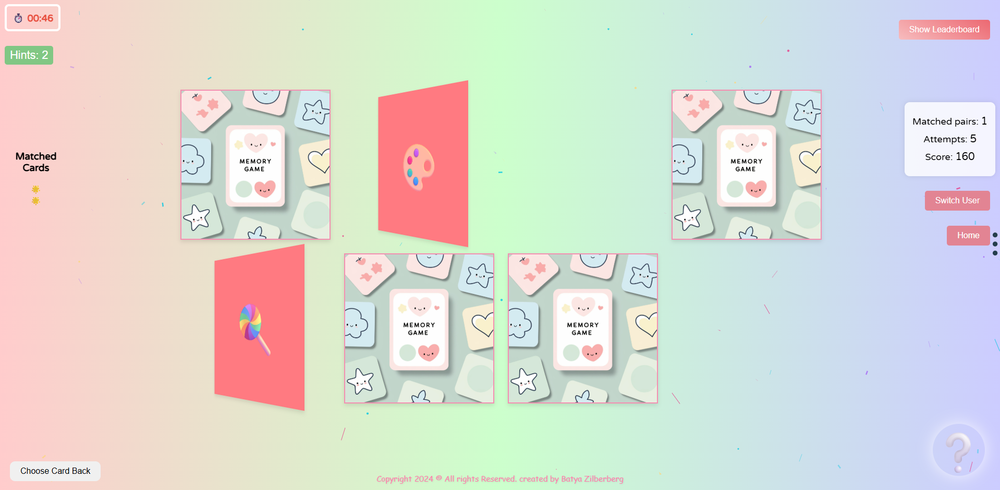
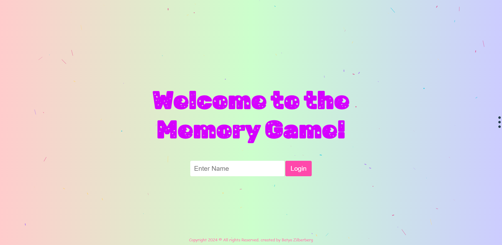
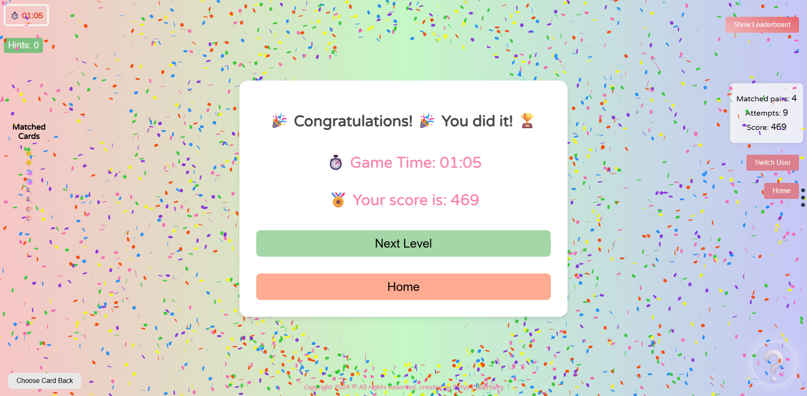

# 🧠 Memory Game
> A fun and interactive memory card game built with pure JavaScript

[](https://batya19.github.io/js-memory-game/)



[](https://developer.mozilla.org/en-US/docs/Web/JavaScript)
[](https://html.spec.whatwg.org/)
[](https://www.w3.org/Style/CSS/)

### 🔐 Login Screen


### 🎮 Gameplay


### 🏆 Victory Screen


## 🌟 Features

- 🎮 **Multiple Difficulty Levels** - Easy (4 pairs), Medium (6 pairs), Hard (9 pairs)
- ⏱️ **Real-time Timer** - Track your performance with precision
- 🏆 **Leaderboard System** - Compare scores with other players
- 💡 **Hint System** - Get help when you're stuck (3 hints per game)
- 🎨 **Customizable Card Backs** - Choose from different card designs
- 🎉 **Celebration Effects** - Confetti animation on victory
- 🎨 **Visual Polish** - Smooth animations and modern UI
- 💾 **Local Storage** - Saves your progress and high scores
- 🔊 **Sound Effects** - Audio feedback for matches and mismatches

## 🚀 Quick Start

### Prerequisites
- Modern web browser (Chrome, Firefox, Safari, Edge)
- No additional installations required!

### Installation
```bash
# Clone the repository
git clone https://github.com/Batya19/js-memory-game.git

# Navigate to project
cd js-memory-game

# Open in browser
open index.html
```

### Playing the Game
```bash
# Simply double-click index.html to start playing!
```

## 🎯 How to Play

1. **Enter Your Name** - Start by entering your player name
2. **Choose Difficulty** - Select Easy, Medium, or Hard mode
3. **Match Cards** - Click cards to reveal and match pairs
4. **Beat the Clock** - Complete all pairs as fast as possible
5. **Use Hints Wisely** - Get help with up to 3 hints per game
6. **Climb the Leaderboard** - Beat your high score and compete!

## 🛠️ Tech Stack

**Frontend:**
- **HTML5** - Semantic markup
- **CSS3** - Modern styling with animations
- **Vanilla JavaScript** - Pure ES6+ functionality

**Features:**
- **Canvas API** - Confetti animations
- **Web Audio API** - Sound effects
- **Local Storage** - Data persistence
- **CSS Grid/Flexbox** - Responsive layout

## 📁 Project Structure
```
memory-game/
├── index.html                # Login page
├── README.md                 # Project documentation
├── pages/
│   └── game.html             # Main game interface
├── scripts/
│   ├── login.js              # Login validation
│   ├── game.js               # Core game logic
│   ├── backgroundConfetti.js # Background effects
│   └── winConfetti.js        # Victory celebration
├── styles/
│   ├── login.css             # Login page styling
│   ├── background.css        # Background effects
│   └── game.css              # Game interface styling
├── images/                   # Game assets
│   ├── 1.jpg - 8.jpg         # Card back designs
│   ├── emoji-direction.gif   # Direction indicator
│   └── happy-blij.gif        # Favicon
└── sounds/                   # Audio files
    ├── card-match.mp3        # Match sound effect
    ├── card-mismatch.mp3     # Mismatch sound effect
    └── game-win.mp3          # Victory sound
```

## 🎮 Game Components

### 🔐 Authentication System
- **Login Validation** - Name validation with regex
- **Player Management** - Store and retrieve player data
- **User Switching** - Easy player switching functionality

### 🎯 Core Game Logic
- **Card Management** - Dynamic card generation and shuffling
- **Match Detection** - Smart pair matching algorithm
- **Timer System** - Precise time tracking with pause/resume
- **Score Calculation** - Performance-based scoring system

### 🎨 Visual Features
- **Card Animations** - Smooth flip and match animations
- **Confetti Effects** - Celebration particles on victory
- **Responsive Grid** - Adaptive card layouts
- **Custom Themes** - Multiple card back designs

### 🏆 Progress Tracking
- **High Scores** - Personal best tracking
- **Statistics** - Attempts, time, and difficulty tracking
- **Leaderboard** - Global player rankings
- **Achievement System** - Performance milestones

### 🎵 Audio Features
- **Match Sound** - Positive feedback for correct matches
- **Mismatch Sound** - Audio cue for incorrect attempts  
- **Victory Sound** - Celebration music on game completion
- **Smart Audio Management** - Optimized sound playback

## 🔧 Configuration

The game automatically adapts to different difficulty levels with optimized card layouts and sizing for the best gaming experience.

## 🎖️ Scoring System

- **Base Points:** 15 points per matched pair
- **Time Bonus:** Up to 150 bonus points based on speed
- **Difficulty Multiplier:** Higher difficulty = higher potential scores
- **Penalty System:** No point deduction for mistakes (encouraging gameplay)

## 🏅 Achievements

- 🚀 **Speed Demon** - Complete easy mode under 30 seconds
- 🧠 **Memory Master** - Complete hard mode without hints
- 🎯 **Perfect Game** - Complete any mode without mistakes
- 📈 **Consistency** - Play 5 games in a row

## 📜 Available Scripts

```bash
# No build process required!
# Simply double-click index.html to start playing
```

## 🌐 Browser Support
- ✅ Chrome 80+
- ✅ Firefox 75+  
- ✅ Safari 13+
- ✅ Edge 80+

## 🔮 Future Enhancements
- 🌍 **Multiplayer Mode** - Challenge friends online
- 🎵 **Music Themes** - Background music options  
- 🏆 **Online Leaderboards** - Global competition
- 🎨 **Custom Card Sets** - Upload your own images
- 📊 **Detailed Analytics** - Performance insights
- 🎯 **Daily Challenges** - Special game modes
- 📱 **Mobile Optimization** - Better touch experience

## 🤝 Contributing

1. Fork the project
2. Create feature branch (`git checkout -b feature/amazing-feature`)
3. Commit changes (`git commit -m 'Add amazing feature'`)
4. Push to branch (`git push origin feature/amazing-feature`)
5. Open Pull Request

## 🐛 **Known Issues**
- Confetti animation may lag on older devices
- Audio autoplay restrictions on some browsers  
- Local storage limitations (10MB typical limit)

## 📄 License

This project is licensed under the MIT License - see the LICENSE file for details.

## 👩‍💻 Author

**Batya Zilberberg** - [GitHub](https://github.com/Batya19)

## 🙏 Acknowledgments

- Emoji designers for beautiful card symbols
- Canvas Confetti library for celebration effects
- Web Audio API for sound management
- CSS Grid/Flexbox for responsive layouts
- Local Storage API for data persistence

## 📞 Support

Found a bug or have a suggestion? Please open an issue!

- 🐛 [Report Bug](https://github.com/Batya19/js-memory-game/issues)
- 💡 [Request Feature](https://github.com/Batya19/js-memory-game/issues)
- 📧 [Contact Developer](mailto:batya21194@gmail.com)

---

<div align="center">
  
**Made with 💖 by Batya Zilberberg - a passionate developer who believes that the best games challenge your mind while bringing joy to your day!**

*Test your memory, challenge your mind, and have fun! 🧠✨*

</div>